# 🚀 AWS ECS Fargate Containerized Task Manager

A production-style containerized web application deployed on **Amazon ECS Fargate** using **Docker**, **Amazon ECR**, and an **Application Load Balancer (ALB)**.

This project demonstrates modern cloud-native deployment practices by containerizing a Python Flask application, storing the image in Amazon ECR, and running it serverlessly on ECS Fargate without managing any EC2 servers.

---

## 📌 Project Overview

The application was:

- Developed using **Python Flask**
- Containerized using **Docker**
- Stored in **Amazon Elastic Container Registry (ECR)**
- Deployed using **Amazon ECS Fargate**
- Exposed publicly through an **Application Load Balancer**
- Monitored using ECS health checks and target groups

---

## 🏗️ Architecture Diagram

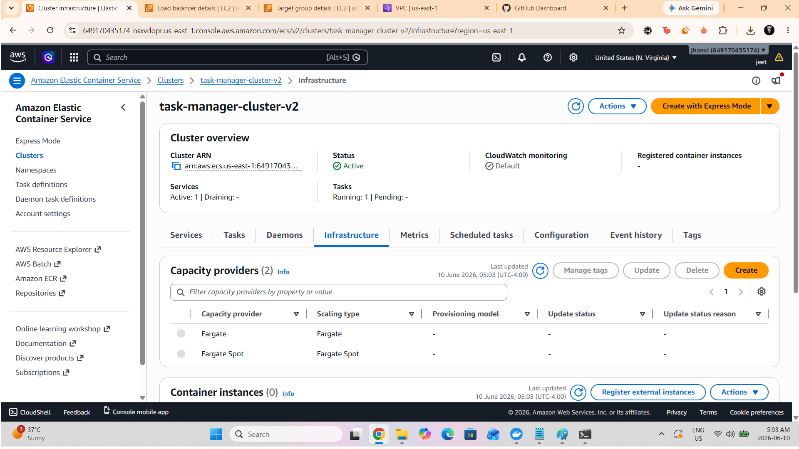

---

## ☁️ AWS Services Used

| Service | Purpose |
|----------|----------|
| Amazon ECS | Container orchestration |
| AWS Fargate | Serverless container hosting |
| Amazon ECR | Docker image repository |
| Application Load Balancer | Traffic distribution |
| IAM | Permissions management |
| VPC | Networking |
| Security Groups | Network security |
| CloudWatch | Container logs |

---

## 📁 Project Structure

```text
aws-ecs-task-manager
│
├── app.py
├── requirements.txt
├── Dockerfile
├── README.md
│
└── screenshots
    ├── alb-created.png
    ├── docker-image-built.png
    ├── ecr-image-pushed.png
    ├── ecr-image-visible.png
    ├── ecr-repository-created.png
    ├── ecs-cluster-created.png
    ├── ecs-cluster-overview.png
    ├── ecs-live-application.png
    ├── ecs-service-running.png
    ├── ecs-task-running.png
    ├── local-container-running.png
    └── task-definition-created.png
```

---

## 🐳 Docker Commands

### Build Image

```bash
docker build -t task-manager .
```

### Run Container

```bash
docker run -p 5000:5000 task-manager
```

### Access Application

```text
http://localhost:5000
```

---

## 🚀 Deployment Workflow

### 1️⃣ Create Flask Application

Created a simple Python Flask web application.

### 2️⃣ Containerize Application

Built a Docker image using a custom Dockerfile.

### 3️⃣ Push Image to Amazon ECR

Created an ECR repository and uploaded the image.

### 4️⃣ Create ECS Fargate Cluster

Provisioned a serverless container environment.

### 5️⃣ Create Task Definition

Configured:

- CPU & Memory
- Container Image
- Port Mapping
- Networking

### 6️⃣ Deploy ECS Service

Connected the service to:

- Application Load Balancer
- Target Group
- Security Groups

### 7️⃣ Validate Deployment

Verified:

- Healthy Targets
- Running Tasks
- Public Access through ALB

---

# 📸 Project Screenshots

## Local Container Running

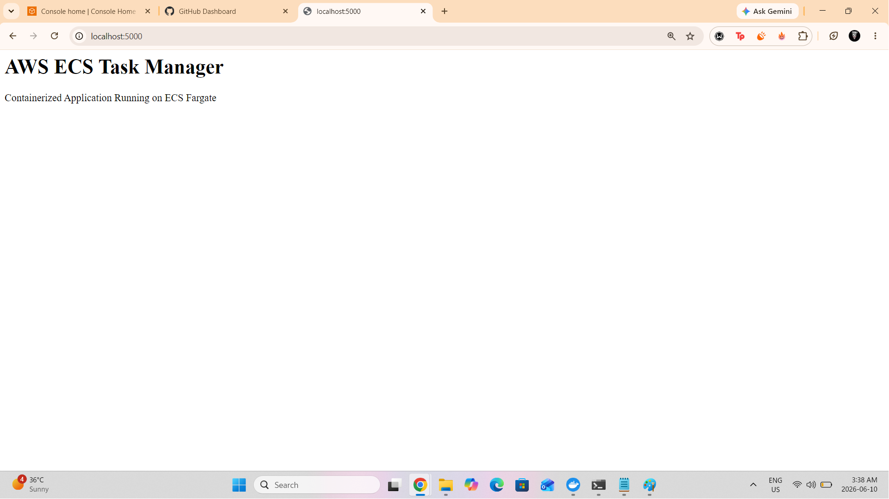

---

## Docker Image Built Successfully

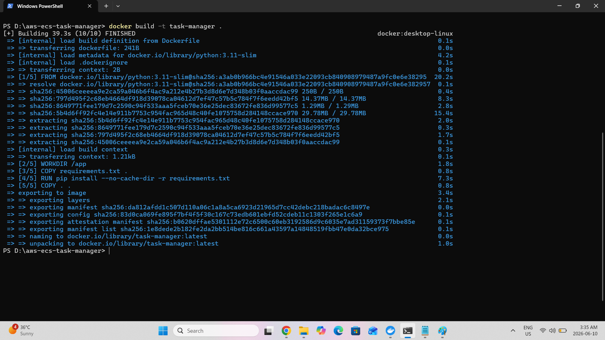

---

## ECR Repository Created

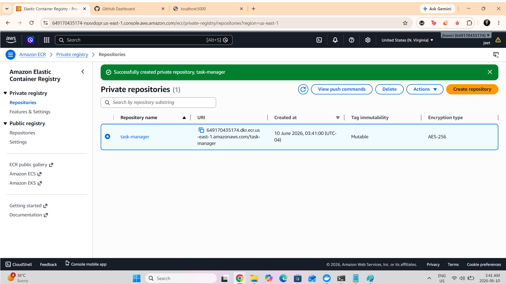

---

## Docker Image Pushed to ECR

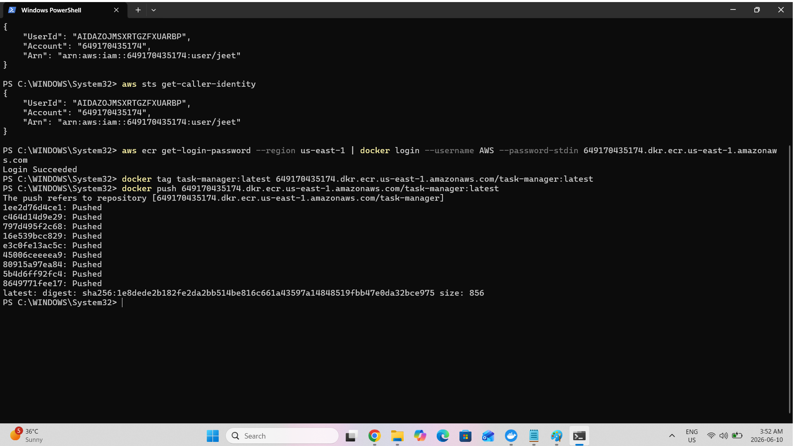

---

## Docker Image Visible in ECR

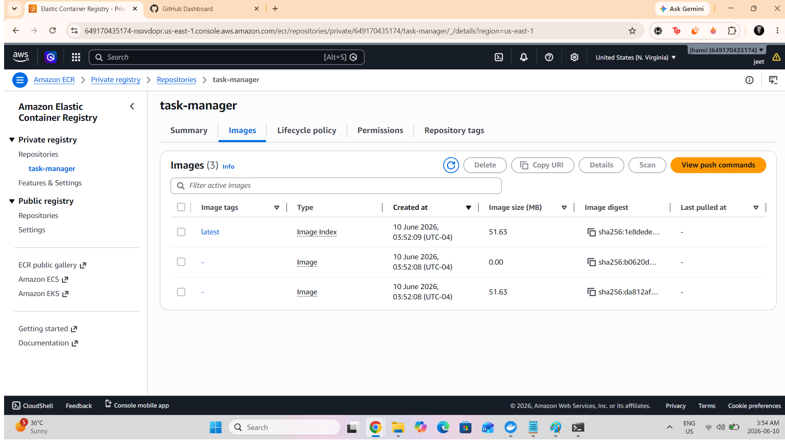

---

## ECS Cluster Created

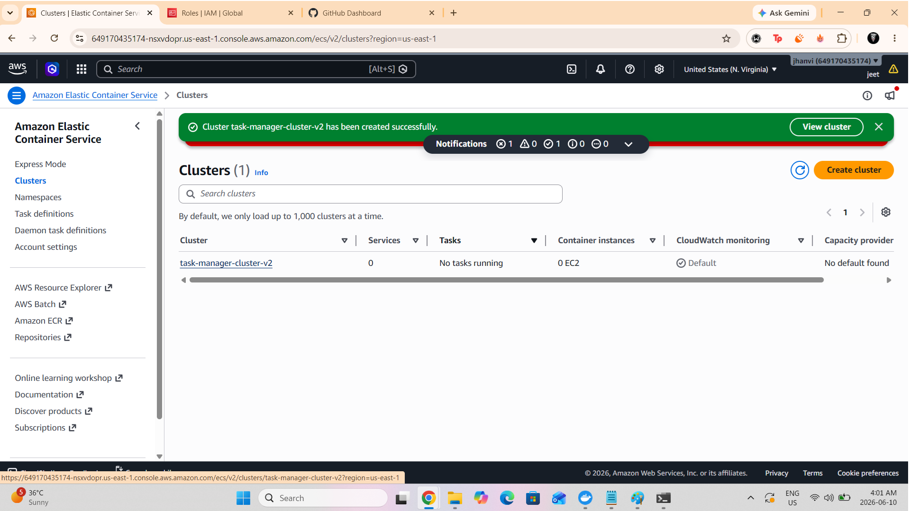

---

## ECS Cluster Overview


---

## Task Definition Created

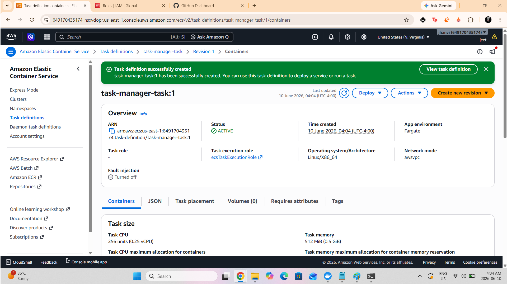

---

## ECS Service Running

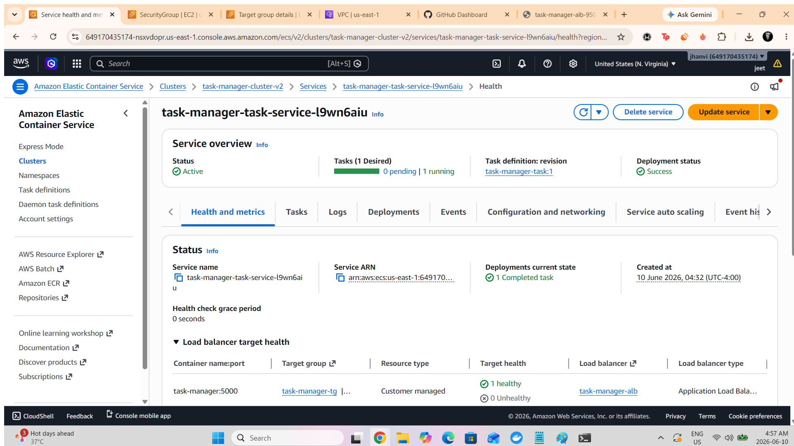

---

## ECS Task Running

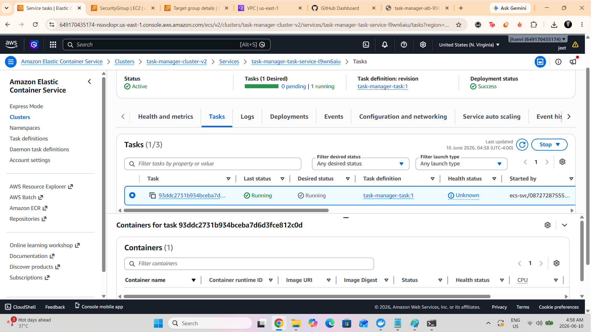

---

## Application Load Balancer

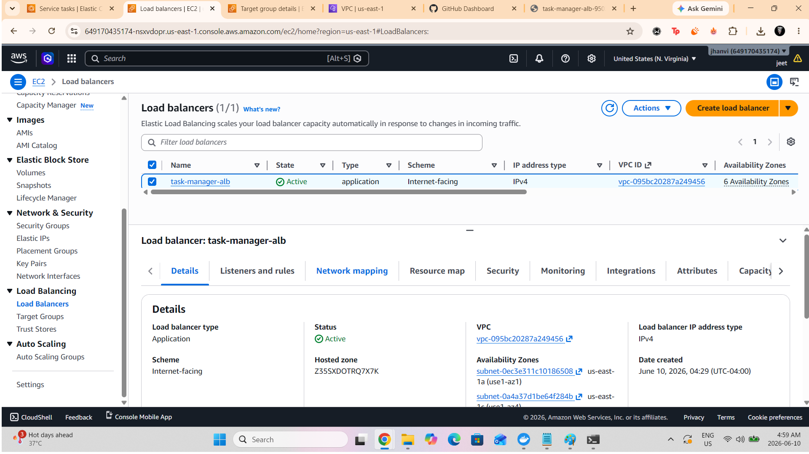

---

## Live Application Running on ECS Fargate

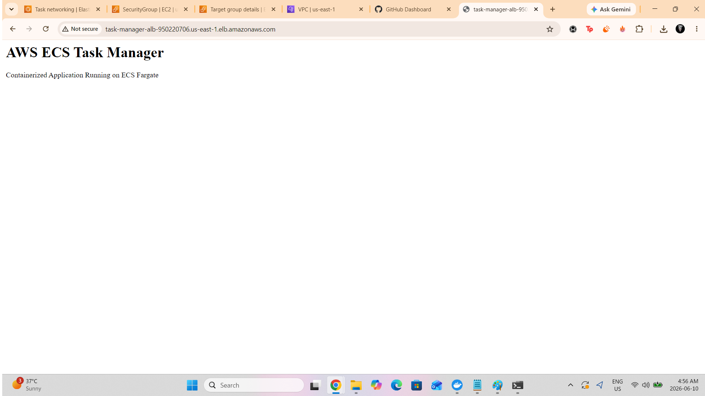

---

## 🎯 Skills Demonstrated

- Docker Containerization
- Amazon ECS
- AWS Fargate
- Amazon ECR
- Application Load Balancer
- ECS Task Definitions
- Health Checks
- Cloud Networking
- Security Groups
- Cloud Troubleshooting

---

## 📈 Key Learning Outcomes

- Building Docker Images
- Running Containers Locally
- Container Registry Management
- Serverless Container Deployments
- Load Balancer Configuration
- ECS Service Management
- Target Group Health Monitoring

---

## 🧹 AWS Cleanup

To avoid AWS charges:

### Delete ECS Service

Amazon ECS → Clusters → Services → Delete

### Delete ECS Cluster

Amazon ECS → Clusters → Delete

### Deregister Task Definitions

Amazon ECS → Task Definitions → Deregister

### Delete Load Balancer

EC2 → Load Balancers → Delete

### Delete Target Group

EC2 → Target Groups → Delete

### Delete ECR Repository

Amazon ECR → Repository → Delete

---

## 👨‍💻 Author

**Jeet Zala**

AWS Cloud & DevOps Portfolio Project

⭐ If you found this project useful, feel free to star the repository.
