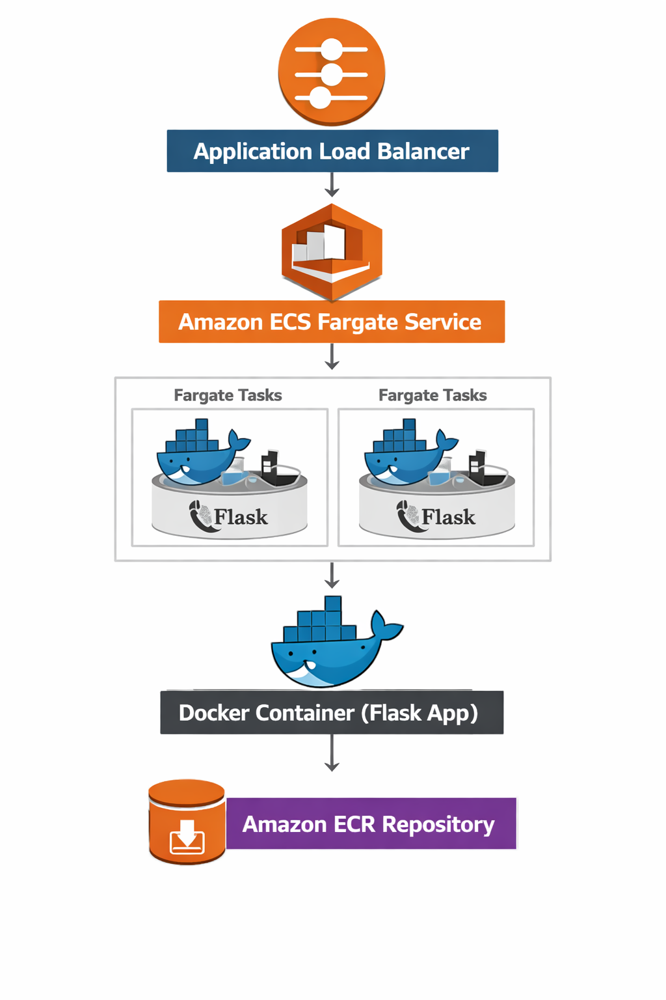

# ☁️ AWS ECS Fargate Task Manager

This project demonstrates the design and deployment of a containerized application on **Amazon Web Services (AWS)** using **Amazon ECS Fargate, Docker, Amazon ECR, an Application Load Balancer (ALB), AWS Secrets Manager, IAM, Amazon CloudWatch, AWS CodePipeline, AWS CodeBuild, AWS CodeConnections, Amazon S3, and Terraform**.

The application is a Python Flask web application containerized with Docker and deployed to ECS Fargate behind an Application Load Balancer.

The project was built and validated in the **AWS US East (N. Virginia) Region (`us-east-1`)**.

---

# 🚀 Project Highlights

✅ Python Flask Application

✅ Docker Containerization

✅ Docker Health Check

✅ Non-Root Container User

✅ Amazon ECR Container Registry

✅ Amazon ECS Fargate

✅ Application Load Balancer

✅ ECS Target Group Health Checks

✅ ECS Service Rolling Deployments

✅ AWS Secrets Manager

✅ IAM Least-Privilege Access

✅ Amazon CloudWatch Logs

✅ GitHub Integration

✅ AWS CodePipeline

✅ AWS CodeBuild

✅ Automated Docker Build & Test

✅ Automated ECR Image Push

✅ Automated ECS Deployment

✅ Terraform Infrastructure as Code

✅ Existing AWS Resource Import

✅ Terraform Drift Validation

✅ End-to-End Application Validation

---

# 🏗️ Architecture Overview

## Architecture Diagram



The application and deployment infrastructure is organized into the following flow:

```text
                         GitHub
                            │
                            ▼
                    AWS CodePipeline
                            │
                            ▼
                     AWS CodeBuild
                            │
                  ┌─────────┴─────────┐
                  │                   │
             Docker Build        Health Test
                  │
                  ▼
              Amazon ECR
                  │
                  ▼
          ECS Task Definition
                  │
                  ▼
           ECS Fargate Service
                  │
                  ▼
       Application Load Balancer
                  │
                  │ HTTP :80
                  ▼
          Flask Application
              Container :5000
```

Supporting services provide security and observability:

```text
ECS Fargate Task
      │
      ├── AWS Secrets Manager
      │       └── TASK_MANAGER_TOKEN
      │
      ├── IAM Execution Role
      │       └── secretsmanager:GetSecretValue
      │
      └── CloudWatch Logs
              └── /aws/ecs/task-manager
```

Terraform is used to manage the deployed infrastructure as code.

---

# 🧱 Infrastructure Components

### Application

* Python Flask
* `/` application endpoint
* `/health` health endpoint
* Gunicorn
* Non-root Docker user

### Container Platform

* Docker
* Amazon ECR
* Amazon ECS
* AWS Fargate
* ECS Task Definition
* ECS Service

### Load Balancing

* Application Load Balancer
* HTTP Listener
* IP Target Group
* ALB Health Checks

### Security & Operations

* Security Groups
* IAM
* AWS Secrets Manager
* Amazon CloudWatch Logs

### CI/CD

* GitHub
* AWS CodeConnections
* AWS CodePipeline
* AWS CodeBuild
* Amazon S3 artifact storage

### Infrastructure as Code

* Terraform
* Terraform variables
* Terraform outputs
* Terraform resource imports
* Terraform state management
* Infrastructure drift validation

---

# 🧰 AWS Services Used

* Amazon VPC
* Amazon ECS
* AWS Fargate
* Amazon ECR
* Application Load Balancer
* Amazon CloudWatch
* AWS Secrets Manager
* AWS IAM
* AWS CodePipeline
* AWS CodeBuild
* AWS CodeConnections
* Amazon S3
* Security Groups

### Infrastructure as Code

* Terraform

---

# 🔐 Security Architecture

The application is exposed through the ALB while the ECS container port is restricted to traffic from the ALB security group.

```text
Internet
   │
   │ HTTP :80
   ▼
ALB Security Group
   │
   │ HTTP :80
   ▼
Application Load Balancer
   │
   │ TCP :5000
   ▼
ECS Security Group
   │
   ▼
ECS Fargate Task
```

### Security Group Rules

**ALB Security Group**

```text
HTTP :80
Source: 0.0.0.0/0
```

**ECS Security Group**

```text
TCP :5000
Source: ALB Security Group
```

This prevents direct Internet access to the container application port.

The ECS task still has outbound access required for container operation and AWS service communication.

---

# 🔑 Secrets Management

The application uses **AWS Secrets Manager** rather than hard-coding application credentials.

Secret:

```text
task-manager/app-token
```

The secret is injected into the ECS container as:

```text
TASK_MANAGER_TOKEN
```

The application checks whether the variable is present through the `/health` endpoint without exposing its value.

Example:

```json
{
  "status": "healthy",
  "secret_loaded": true
}
```

The secret value is not stored in:

* GitHub
* Dockerfile
* Application source code
* ECS task-definition template
* `buildspec.yml`

The ECS task execution role is granted:

```text
secretsmanager:GetSecretValue
```

only for the required application secret.

---

# 📊 CloudWatch Logging

CloudWatch Logs is used for ECS container/application logging.

Log group:

```text
/aws/ecs/task-manager
```

Retention:

```text
7 days
```

The ECS task definition uses the AWS Logs driver:

```text
awslogs
```

with the stream prefix:

```text
ecs
```

---

# 🔄 CI/CD Pipeline

The project includes a GitHub-to-ECS deployment pipeline.

```text
GitHub
   │
   ▼
AWS CodeConnections
   │
   ▼
AWS CodePipeline
   │
   ▼
AWS CodeBuild
   │
   ├── Docker build
   ├── Local health check
   ├── ECR image push
   ├── ECS task-definition registration
   └── ECS service update
             │
             ▼
        ECS Fargate
             │
             ▼
        Application ALB
```

### CodePipeline

Pipeline:

```text
task-manager-pipeline
```

Source:

```text
GitHub
jeetzala/aws-ecs-task-manager
```

Branch:

```text
main
```

### CodeBuild

Build project:

```text
task-manager-build
```

The build environment uses Docker privileged mode so the pipeline can build the application image.

The build process:

1. Authenticate with Amazon ECR
2. Build the Docker image
3. Run the image locally inside CodeBuild
4. Test `/health`
5. Stop the test container
6. Push the image to ECR
7. Render the ECS task definition
8. Register a new ECS task-definition revision
9. Update the ECS service
10. Wait for the ECS service to become stable

---

# 🐳 Docker Image Versioning

The initial images were pushed manually during project development:

```text
v1.0.0
v1.0.1
```

The automated pipeline generates versioned image tags using the CodeBuild build number:

```text
v2.0.x
```

The resulting image version is also passed to ECS through:

```text
APP_VERSION
```

An Amazon ECR lifecycle policy keeps only the latest three tagged images matching the `v` prefix.

---

# 🚀 ECS Fargate Deployment

The application runs on:

```text
ECS Cluster:
task-manager-cluster-v2

ECS Service:
task-manager-service

Launch Type:
FARGATE

CPU:
256

Memory:
512 MB

Container Port:
5000
```

The service is configured with one desired running task for the portfolio environment.

### Task Definition

The application task definition includes:

```text
Container Image
CPU & Memory
Port Mapping
Environment Variables
Secrets Manager Injection
Container Health Check
CloudWatch Logging
```

---

# ❤️ Health Checks

Health is validated at multiple layers:

```text
Docker HEALTHCHECK
        │
        ▼
ECS Container Health
        │
        ▼
ALB Target Group Health Check
        │
        ▼
Flask /health
```

The ALB health check uses:

```text
Protocol: HTTP
Port: 5000
Path: /health
Expected Code: 200
```

The final deployed application returned:

```text
status: healthy
secret_loaded: true
```

---

# 🔁 Rolling Deployment

The ECS service uses rolling deployments.

The deployment process is:

```text
Old ECS Task
     │
     ▼
New Task Starts
     │
     ▼
Container Health Check
     │
     ▼
ALB Target Becomes Healthy
     │
     ▼
Old Target Drains
     │
     ▼
Old Task Stops
```

The ECS service uses a deployment circuit breaker with rollback enabled.

During testing, the new task became healthy while the previous target entered:

```text
draining
```

This verified normal ECS rolling-deployment behavior.

---

# 📁 Project Structure

```text
aws-ecs-task-manager/
│
├── app.py
├── requirements.txt
├── Dockerfile
├── buildspec.yml
├── task-definition-template.json
├── README.md
├── .dockerignore
├── .gitignore
│
├── terraform/
│   ├── main.tf
│   ├── variables.tf
│   ├── resources.tf
│   ├── outputs.tf
│   └── .terraform.lock.hcl
│
└── screenshots/
    ├── architechture-diagram.png
    ├── alb-created.png
    ├── docker-image-built.png
    ├── ecr-image-pushed.png
    ├── ecr-image-visible.png
    ├── ecr-repository-created.png
    ├── ecs-cluster-created.png
    ├── ecs-cluster-overview.png
    ├── ecs-live-application.png
    ├── ecs-service-running.png
    ├── ecs-task-running.png
    ├── local-container-running.png
    └── task-definition-created.png
```

Terraform state files and the `.terraform` working directory are intentionally excluded from the repository.

---

# 📸 Screenshots

## 🌐 1. Application Load Balancer


The Application Load Balancer provides the public HTTP entry point for the ECS application.

---

## 🐳 2. Local Container Running


The Flask application was first validated locally inside a Docker container.

---

## 🏗️ 3. Docker Image Built Successfully


The Docker image was built successfully using the project Dockerfile.

---

## 📦 4. ECR Repository Created


The `task-manager` container repository was created in Amazon ECR.

---

## ⬆️ 5. Docker Image Pushed to ECR


The Docker image was successfully pushed to Amazon ECR.

---

## 🔎 6. Docker Image Visible in ECR


The application image is available in the ECR repository.

---

## ☁️ 7. ECS Cluster Created


The ECS Fargate cluster was created for the application.

---

## 📊 8. ECS Cluster Overview


The ECS cluster and service configuration can be reviewed from the ECS console.

---

## 📋 9. Task Definition


The ECS task definition configures the container image, resources, networking, health check, logging, and runtime environment.

---

## 🚀 10. ECS Service Running


The ECS service maintains the desired running task and is connected to the ALB target group.

---

## 🟢 11. ECS Task Running


The Fargate task was verified as running and healthy.

---

## 🌍 12. Live Application


The application is publicly accessible through the Application Load Balancer.

---

# 🧩 Infrastructure as Code with Terraform

The existing AWS infrastructure was imported into **Terraform** rather than recreated.

Terraform configuration is stored in:

```text
terraform/
```

### Terraform Files

```text
main.tf
variables.tf
resources.tf
outputs.tf
.terraform.lock.hcl
```

### Terraform-Managed Resources

Terraform represents:

```text
ECS Cluster
ECS Service
Application Load Balancer
ALB Listener
Target Group
ALB Security Group
ECS Security Group
ECR Repository
ECR Lifecycle Policy
CloudWatch Log Group
Secrets Manager Secret
IAM Secret Access Policy
```

### Terraform and CI/CD Separation

Terraform manages the infrastructure configuration.

The GitHub → CodePipeline → CodeBuild workflow manages changing ECS task-definition revisions generated from application deployments.

The ECS service therefore ignores task-definition changes so Terraform does not overwrite the revision deployed by CI/CD.

### Terraform Validation

The infrastructure was validated using:

```bash
terraform fmt
terraform validate
terraform plan
```

Terraform returned:

```text
Success! The configuration is valid.
```

The final infrastructure plan showed:

```text
No changes.
Your infrastructure matches the configuration.
```

The plan contained:

```text
0 to add
0 to change
0 to destroy
```

This confirms that the Terraform configuration matches the imported live infrastructure without proposing resource creation, modification, or destruction.

---

# 📘 How This Project Works

## ✔️ Step 1 — Create the Flask Application

Created a lightweight Python Flask application with:

```text
/
/health
```

The `/health` endpoint provides application health information and confirms that the runtime secret has been injected.

---

## ✔️ Step 2 — Containerize the Application

Created a Docker image using a custom Dockerfile.

The container includes:

* Flask
* Gunicorn
* Docker health check
* Non-root application user

The application listens on:

```text
TCP :5000
```

---

## ✔️ Step 3 — Test the Container Locally

The application was tested locally using Docker.

Validation included:

```text
Container running
Application accessible
/health → healthy
Docker health → healthy
```

---

## ✔️ Step 4 — Push the Image to Amazon ECR

Created:

```text
task-manager
```

in Amazon ECR.

Images were pushed using versioned tags.

The repository also includes a lifecycle policy to retain only the latest three tagged images matching the `v` prefix.

---

## ✔️ Step 5 — Create ECS Fargate Infrastructure

Created:

```text
ECS Cluster
ECS Service
Fargate Task Definition
Application Load Balancer
Target Group
HTTP Listener
Security Groups
```

The ECS task runs with:

```text
256 CPU
512 MB Memory
Port 5000
```

---

## ✔️ Step 6 — Configure Application Health Checks

Configured health checks at:

```text
Docker
ECS
ALB
Application
```

The ALB checks:

```text
/health
```

and expects:

```text
HTTP 200
```

---

## ✔️ Step 7 — Secure Application Secrets

Created:

```text
task-manager/app-token
```

in AWS Secrets Manager.

The secret is injected into the container as:

```text
TASK_MANAGER_TOKEN
```

The ECS execution role receives only the required:

```text
secretsmanager:GetSecretValue
```

permission for the application secret.

---

## ✔️ Step 8 — Configure CloudWatch Logging

Created:

```text
/aws/ecs/task-manager
```

with:

```text
7-day retention
```

The ECS container sends application logs to CloudWatch.

---

## ✔️ Step 9 — Configure CI/CD

Connected:

```text
GitHub
   ↓
AWS CodeConnections
   ↓
CodePipeline
   ↓
CodeBuild
```

The pipeline automatically:

```text
Builds Docker image
Runs health test
Pushes image to ECR
Creates ECS task definition revision
Updates ECS service
Waits for stable deployment
```

---

## ✔️ Step 10 — Validate Rolling Deployment

The ECS service was successfully updated through CI/CD.

The new task became:

```text
RUNNING
HEALTHY
```

The ALB target became:

```text
healthy
```

The previous task entered:

```text
draining
```

and was subsequently removed.

---

## ✔️ Step 11 — Manage Infrastructure with Terraform

The existing AWS infrastructure was imported into Terraform.

Terraform was validated using:

```bash
terraform fmt
terraform validate
terraform plan
```

✅ Terraform configuration validated

✅ Existing AWS resources imported

✅ Infrastructure drift checked

✅ No resources proposed for creation, modification, or destruction

---

# 🧪 Validation Results

| Component                 | Status     |
| ------------------------- | ---------- |
| Docker Container          | ✅ Verified |
| Docker Health Check       | ✅ Verified |
| Amazon ECR                | ✅ Verified |
| ECS Cluster               | ✅ Verified |
| ECS Fargate Task          | ✅ Verified |
| ECS Container Health      | ✅ Verified |
| Application Load Balancer | ✅ Verified |
| ALB Target Health         | ✅ Verified |
| `/health` Endpoint        | ✅ Verified |
| Secrets Manager           | ✅ Verified |
| IAM Least Privilege       | ✅ Verified |
| CloudWatch Logs           | ✅ Verified |
| CodeConnections           | ✅ Verified |
| CodePipeline              | ✅ Verified |
| CodeBuild                 | ✅ Verified |
| Automated ECR Push        | ✅ Verified |
| Automated ECS Deployment  | ✅ Verified |
| Rolling Deployment        | ✅ Verified |
| Terraform Configuration   | ✅ Verified |
| Terraform Infrastructure  | ✅ Verified |
| End-to-End Application    | ✅ Verified |

---

# 💼 What I Learned

* Building and containerizing Python applications
* Writing Dockerfiles for cloud deployment
* Running and validating Docker containers locally
* Using non-root container users
* Implementing Docker health checks
* Managing Docker images with Amazon ECR
* Deploying containers with Amazon ECS Fargate
* Configuring Application Load Balancers
* Configuring ECS target groups and health checks
* Implementing restricted Security Group communication
* Managing application secrets with AWS Secrets Manager
* Applying IAM least-privilege principles
* Sending container logs to CloudWatch
* Building GitHub-to-ECS CI/CD pipelines
* Using AWS CodePipeline and CodeBuild
* Automating Docker builds and ECR image publishing
* Automating ECS task-definition registration
* Managing ECS rolling deployments
* Troubleshooting CodePipeline and CodeBuild IAM permissions
* Using AWS CLI for infrastructure management
* Importing existing AWS resources into Terraform
* Using Terraform variables and outputs
* Managing infrastructure as code
* Validating infrastructure using `terraform plan`
* Separating infrastructure management from application deployment
* Documenting cloud infrastructure for a technical portfolio

---

# 🧩 Future Improvements

### High Availability

* Multiple ECS tasks
* ECS Service Auto Scaling
* Multi-AZ task placement
* Capacity and load testing

### Security

* HTTPS with ACM
* HTTPS listener on the ALB
* Route 53 DNS
* AWS WAF
* Further IAM policy refinement
* Automated secret rotation

### CI/CD

* Automated unit tests
* Automated integration tests
* Deployment approval stage
* Blue/green deployment strategy
* Automated rollback testing

### Terraform

* Reusable Terraform modules
* Separate environment configurations
* Remote Terraform state
* Terraform CI validation
* Terraform plan checks in pull requests

### Observability

* CloudWatch dashboard
* Application metrics
* ECS alarms
* ALB error alarms
* Centralized operational dashboards

---

# 🏷️ Project Tags

**AWS • Amazon ECS • AWS Fargate • Amazon ECR • Docker • Flask • Application Load Balancer • CodePipeline • CodeBuild • CodeConnections • Amazon S3 • Secrets Manager • IAM • CloudWatch • Terraform • CI/CD • Containerization • Infrastructure as Code • Cloud Infrastructure • DevOps • AWS Architecture**

---

# 🔗 Connect With Me

GitHub:

https://github.com/jeetzala

LinkedIn:

https://www.linkedin.com/in/jeet-zala-6633832ba/

---

# 🏆 Credits

Built by **Jeet Zala** as part of my AWS Cloud learning journey and cloud infrastructure portfolio.

## Author

**Jeet Zala**

AWS Cloud & DevOps Portfolio Project
